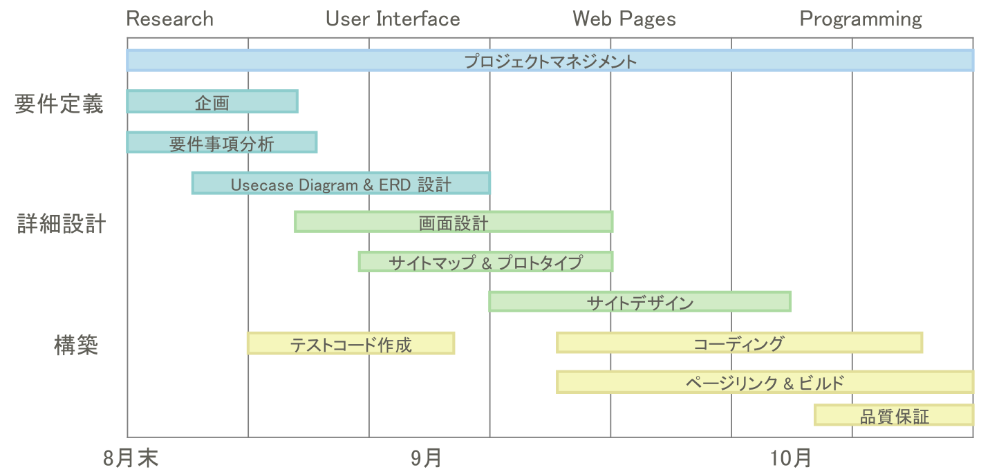

# Credinner　信頼できるグルメサイト、クレディナ―

## 1. プロジェクト概要
* 外出自粛の中で、外食をするならせめて清潔で信頼できるレストランを利用したいという需要に応じ、韓国ソウル特別市より食堂衛生認証を受けたレストランの情報を提供するウェブサイトを作りました。
* レストランの名前と住所(区名)で検索ができ、会員登録したら口コミも作成できます。

## 2. 役割・担当機能
* プロジェクトリーダーを務め、全般的な開発の工程を管理しております。
* 食堂検索機能を担当し、ソウル特別市の公共APIから食堂衛生認証情報を抽出してもらい、画面に表示する機能を具現しております。
* 認証をもらったレストラン情報をAPIから抽出してもらうため、開店や閉店されたレストランの情報もリアルタイムで反映できます。

## 3. 技術スタック
* 言語：Java(1.8.0),JavaScript(ECMA Script 5), HTML5, CSS3
* フレームワーク：MyBatis(3.4.6), Spring MVC(4.3.6)
* データベース：Oracle Database(11g XE)
* サーバー：Apache Tomcat(8.5)
* ツール：Eclipse, STS
* API: ソウル特別市公共データ、Google Maps Places API, SMTP API

## 4. 開発工程

## 5. Teammates
* [Youngin Lee](https://github.com/cocokaribou) - Team Leader, Search Feature using Seoul public API
* [Jacheol Ko](https://github.com/KOJAECHEOL) - User page
* [Junwoo Kim](https://github.com/kjwit) - Review Rating feature
* [Nakyoung Lee](https://github.com/nakyounglee06) - Review create, delete, update feature
* [Junga Lim](https://github.com/Junga-Im) - Join page, SMTP E-mail sender
